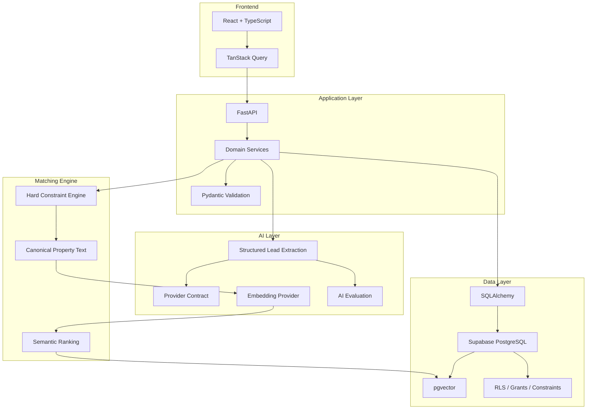
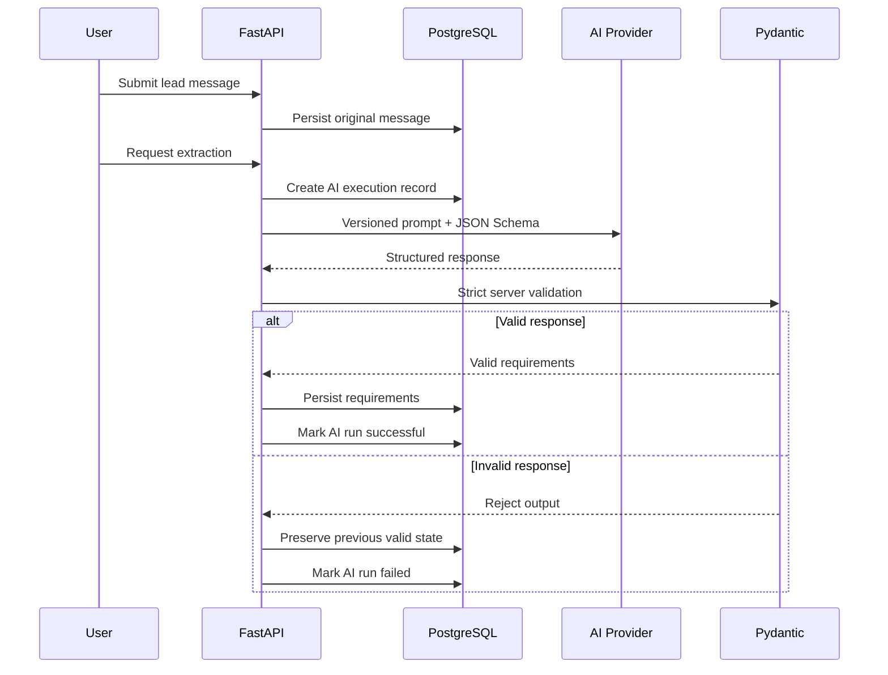
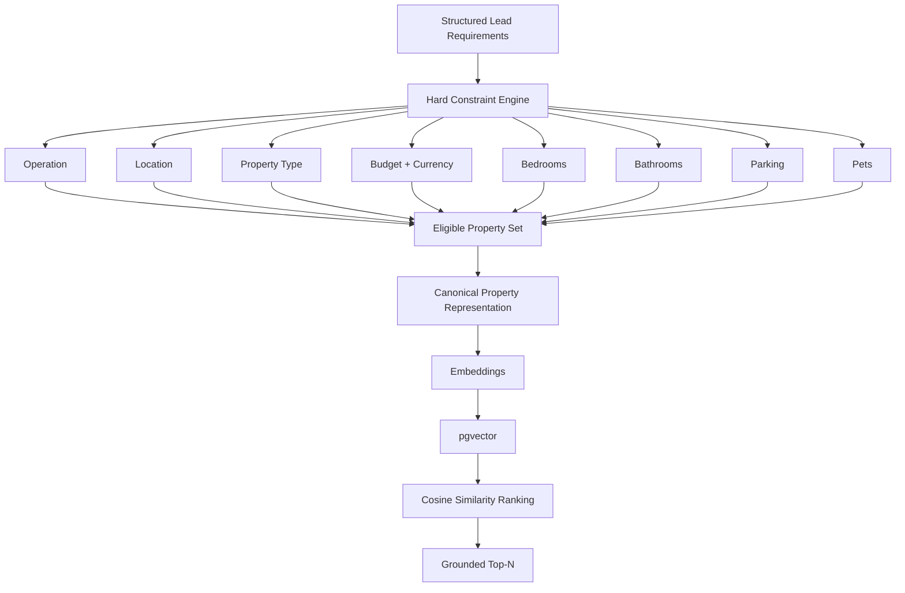
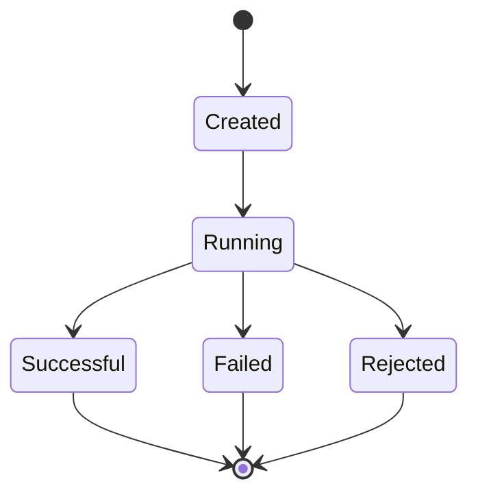
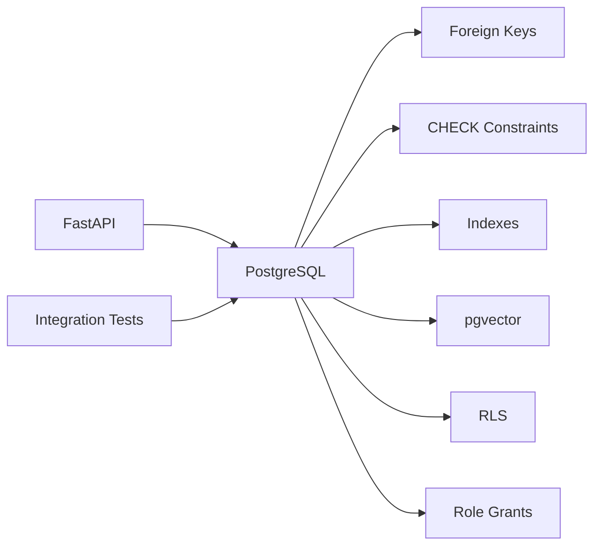
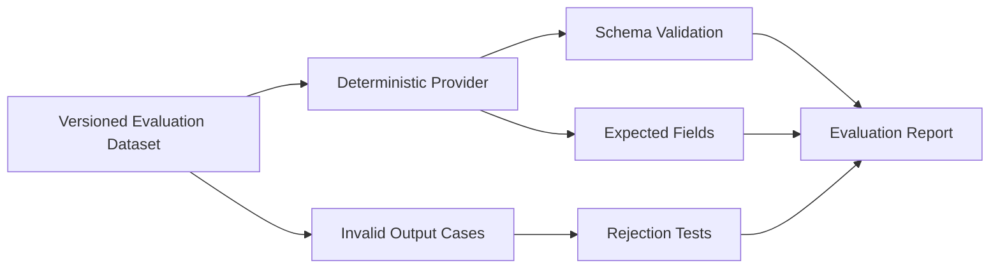
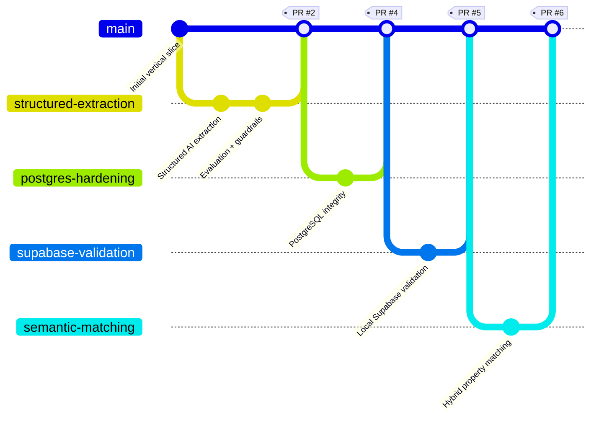

# Arriendate Intelligence

> **Applied AI system for structured real-estate lead intelligence and hybrid property matching.**

Arriendate Intelligence transforms unstructured real-estate conversations into validated requirements, applies deterministic business constraints, and ranks eligible properties using semantic similarity with PostgreSQL + pgvector.

The system is intentionally designed around a simple principle:

**AI can assist with interpretation and ranking, but deterministic rules remain responsible for eligibility and data integrity.**

---

## Overview

A real-estate lead rarely arrives as structured data.

A customer might write:

> "Busco departamento en Providencia o Ñuñoa, máximo 850 mil,
> ojalá con 2 dormitorios, estacionamiento y que acepten mascotas."

Arriendate Intelligence converts that message into a traceable workflow:

```mermaid
flowchart LR
    A["Unstructured Lead"] --> B["Structured AI Extraction"]
    B --> C["Validated Requirements"]
    C --> D["Deterministic Hard Constraints"]
    D --> E["Eligible Properties"]
    E --> F["Embedding Generation"]
    F --> G["pgvector Semantic Ranking"]
    G --> H["Grounded Top-N Matches"]
    H --> I["Human Review"]

    style A stroke-width:2px
    style D stroke-width:2px
    style G stroke-width:2px
    style I stroke-width:2px
```



The AI model never directly decides which properties are valid.

Eligibility is resolved first through deterministic constraints. Semantic search only ranks properties that have already passed those rules.

---

# Why I Built It

Traditional property search usually depends on structured filters:

- location
- price
- bedrooms
- bathrooms
- parking
- property type
- rental/sale operation

But customers do not naturally communicate through database filters.

They communicate through conversations.

Arriendate Intelligence explores how an AI layer can translate those conversations into reliable domain data without letting probabilistic model output bypass business rules or database constraints.

The project focuses on:

- structured LLM outputs
- deterministic validation
- observable AI execution
- hybrid retrieval
- semantic ranking
- PostgreSQL integrity
- AI evaluation
- human-in-the-loop workflows

---

# System Architecture



### Architectural boundaries

The browser never communicates directly with privileged database roles or AI providers.

```text
Browser
   │
   ▼
FastAPI
   ├── Domain validation
   ├── AI provider boundary
   ├── Matching engine
   └── Persistence layer
            │
            ▼
      PostgreSQL / Supabase
```

FastAPI is the trusted boundary for:

- AI execution
- validation
- database access
- matching
- observability
- error sanitization

---

# AI Lead Extraction

The extraction pipeline uses structured model output rather than parsing arbitrary natural-language responses.



Important properties of the pipeline:

- the original message is persisted before AI execution;
- model output is treated as untrusted input;
- structured output is validated again server-side;
- malformed output cannot silently replace valid requirements;
- missing information remains unknown rather than being invented;
- execution metadata is persisted for observability;
- provider credentials remain server-side.

---

# Hybrid Property Matching

The matching pipeline deliberately separates **eligibility** from **semantic relevance**.



### Why constraints come first

Vector similarity is useful for preferences such as:

> "quiet neighborhood with good connectivity"

but should not override requirements such as:

> maximum rent = 800,000 CLP

A semantically attractive property above the user's explicit budget should not appear simply because its embedding is similar.

Therefore:

```text
Eligibility → deterministic
Preference ranking → semantic
Final decision → human
```

---

# Matching Correctness

The matching layer treats several conditions conservatively.

Unknown information does not automatically satisfy a requirement.

Examples include:

- availability
- operation type
- location
- property type
- budget
- currency
- bedroom count
- bathroom count
- parking
- pet policy

Budget comparison requires an explicit compatible operation and currency.

The system does **not** infer currency conversions or silently select an alternative price column.

Semantic similarity is treated as a **ranking signal**, not as a probability of compatibility.

---

# AI Observability

Every extraction attempt has an observable lifecycle.



Telemetry is intentionally sanitized.

The system can preserve information such as:

- execution status
- provider
- model configuration
- prompt version
- latency
- token usage when available
- failure category

without persisting sensitive provider responses, credentials, or prompts unnecessarily.

---

# Reliability and Guardrails

Arriendate Intelligence treats AI as an unreliable external dependency rather than a trusted database writer.

### Structured outputs

Machine-consumed AI output follows an explicit schema.

### Server-side validation

Provider validation is not considered sufficient. Responses are revalidated through Pydantic before entering domain state.

### Stale-state protection

Matching and extraction operations contain protections against results being reused after their underlying inputs change.

### Embedding cache identity

Cached vectors are only reusable when their relevant identity remains compatible, including:

- canonical content
- provider
- model
- vector-space configuration

### Bounded retries

Only transient provider failures are eligible for bounded transport retries.

### Human-triggered execution

Extraction and matching remain explicit actions.

There is no autonomous outbound communication.

---

# PostgreSQL & Supabase

PostgreSQL is treated as an integrity boundary, not simply as storage.



The repository contains authoritative migrations for the PostgreSQL implementation.

The integration suite validates behavior against a real PostgreSQL environment rather than relying exclusively on SQLite mocks.

The local Supabase stack has also been used to validate:

- migrations
- database reset reproducibility
- PostgreSQL
- pgvector
- RLS
- grants
- PostgREST access behavior
- application persistence
- browser E2E flows

---

# Evaluation Strategy

AI functionality is tested independently from live provider availability.



This allows regression testing without:

- API keys
- network dependencies
- provider cost
- nondeterministic model behavior

Live provider evaluation is intentionally opt-in.

---

# Engineering Journey

This repository was built incrementally rather than as a single generated implementation.

Each major capability was developed and hardened through separate branches and pull requests.



### Milestone 1 — Structured AI extraction

**PR #2**

Introduced:

- provider-independent structured generation
- versioned extraction prompts
- strict JSON Schema
- Pydantic validation
- AI execution tracing
- deterministic evaluation
- malformed-output handling
- E2E extraction workflow

This milestone established the project's core AI boundary.

---

### Milestone 2 — PostgreSQL hardening

**PR #4**

Moved the persistence layer toward production-like correctness with PostgreSQL-specific validation and stronger database invariants.

The goal was to ensure that application-level validation was reinforced by database-level integrity.

---

### Milestone 3 — Supabase integration validation

**PR #5**

Validated the application against a complete local Supabase environment.

This included:

- PostgreSQL + pgvector
- reproducible migrations
- deterministic synthetic seed
- RLS
- PostgREST
- authentication-role assumptions
- FastAPI persistence
- browser E2E execution

The milestone intentionally documented remaining production gaps instead of claiming production readiness prematurely.

---

### Milestone 4 — Hybrid semantic property matching

**PR #6**

Introduced:

```text
Structured Requirements
        ↓
Hard Constraints
        ↓
Eligible Properties
        ↓
Canonical Representations
        ↓
Embeddings
        ↓
pgvector
        ↓
Semantic Ranking
        ↓
Top-N Matches
```

The most important design decision was keeping deterministic eligibility outside of semantic similarity.

---

# Technology Stack

| Area | Technology |
|---|---|
| Frontend | React, TypeScript, Vite |
| API | Python, FastAPI |
| Validation | Pydantic |
| ORM | SQLAlchemy |
| Database | PostgreSQL / Supabase |
| Vector Search | pgvector |
| AI | Structured-output provider abstraction |
| Embeddings | Provider-neutral embedding contract |
| Testing | Pytest, Vitest, Testing Library |
| E2E | Playwright |
| Quality | Ruff, mypy, ESLint, TypeScript |
| Infrastructure | Docker / Local Supabase |
| CI | GitHub Actions |

---

# Repository Structure

```text
arriendate-intelligence/
│
├── apps/
│   ├── api/
│   │   ├── app/
│   │   │   ├── ai/
│   │   │   ├── embeddings/
│   │   │   ├── evaluation/
│   │   │   └── matching/
│   │   └── tests/
│   │
│   └── web/
│
├── docs/
│
├── evals/
│   ├── datasets/
│   └── scripts/
│
├── supabase/
│   ├── migrations/
│   └── seed/
│
└── .github/
    └── workflows/
```

---

# API Surface

| Method | Endpoint | Purpose |
|---|---|---|
| `GET` | `/api/health` | Database readiness |
| `POST` | `/api/leads` | Create lead |
| `GET` | `/api/leads/{id}` | Lead intelligence |
| `POST` | `/api/leads/{id}/extract` | Structured AI extraction |
| `POST` | `/api/leads/{id}/matches` | Generate property matches |
| `GET` | `/api/leads/{id}/matches` | Latest matching result |
| `GET` | `/api/properties` | Property inventory |
| `GET` | `/api/properties/{id}` | Property details |

---

# Demo

The repository uses **synthetic property and lead data** for demonstration and evaluation.

A typical demo flow is:

```text
1. Create an unstructured lead
2. Persist original message
3. Trigger structured extraction
4. Inspect validated requirements
5. Generate matches
6. Apply deterministic eligibility
7. Rank eligible properties semantically
8. Inspect Top-N recommendations
9. Review AI execution telemetry
```

### Example

```text
Lead:

"Busco un departamento para arrendar en Providencia,
máximo 900 mil pesos, dos dormitorios, estacionamiento
y ojalá que acepten mascotas."
```

Becomes conceptually:

```json
{
  "operation": "rent",
  "locations": ["Providencia"],
  "max_budget": 900000,
  "currency": "CLP",
  "bedrooms": 2,
  "parking": 1,
  "pets": true
}
```

Then:

```text
Hard eligibility
      ↓
Eligible inventory
      ↓
Semantic preference ranking
      ↓
Top-N grounded matches
```

> A short product walkthrough / GIF will be added here.

---

# Running Locally

## Requirements

- Python 3.12+
- Node.js
- Docker
- Supabase CLI for the full local stack

### Install

```powershell
Copy-Item .env.example .env

python -m venv .venv
.\.venv\Scripts\python.exe -m pip install -e ".\apps\api[dev]"

npm.cmd install
```

### Run API

```powershell
.\.venv\Scripts\python.exe -m app.server
```

### Run frontend

```powershell
npm.cmd run dev:web
```

Frontend:

```text
http://127.0.0.1:5173
```

API documentation:

```text
http://127.0.0.1:8000/docs
```

---

# PostgreSQL Validation

Start the local Supabase stack:

```powershell
npm.cmd exec supabase -- start
npm.cmd exec supabase -- db reset --local
```

Then run PostgreSQL integration tests against an isolated test database.

The PostgreSQL suite validates:

- migrations from zero
- constraints
- role assumptions
- RLS
- grants
- pgvector
- persistence behavior
- synthetic seed integrity

---

# Quality Gates

The project uses multiple validation layers before changes are merged.

```text
                    ┌──────────────┐
                    │ Pull Request │
                    └──────┬───────┘
                           │
          ┌────────────────┼────────────────┐
          ▼                ▼                ▼
      Backend          Database         Frontend
      tests            integration       tests
          │                │                │
          ▼                ▼                ▼
       Ruff            PostgreSQL       ESLint
       mypy             pgvector        TypeScript
          │                │                │
          └────────────────┼────────────────┘
                           ▼
                      E2E / Build
                           │
                           ▼
                         Merge
```

The committed test suite does not require production AI credentials.

---

# Security Principles

The project intentionally avoids several common AI application anti-patterns.

### No browser AI secrets

Provider credentials remain on the server.

### No unrestricted model-to-database path

LLM output must pass domain validation before persistence.

### No unrestricted SQL generation

AI output does not become arbitrary SQL.

### No semantic override of hard requirements

Vector ranking operates only after deterministic eligibility.

### No raw provider telemetry leakage

Errors and execution metadata are sanitized.

### No real customer dataset in the repository

Committed demos and evaluations use synthetic data.

---

# Known Limitations

This project is an engineering prototype / internal system, not a claim of production SaaS readiness.

Current limitations include:

- authentication and tenant isolation are not yet implemented;
- hosted Supabase production configuration has not been validated;
- production abuse controls and rate limiting remain pending;
- production observability requires expansion;
- semantic quality still requires evaluation against larger realistic inventories;
- exact pgvector search is sufficient for the current synthetic inventory but would need reconsideration at larger scale;
- live model evaluations require separately supplied provider credentials;
- AI extraction remains human-triggered;
- autonomous outbound communication is intentionally not implemented.

These constraints are documented deliberately rather than hidden behind a "production-ready" claim.

---

# Design Philosophy

The project follows four core rules:

```text
AI interprets.
Code validates.
PostgreSQL enforces.
Humans decide.
```

That separation makes the system easier to:

- test
- audit
- debug
- evolve
- reason about

while still benefiting from semantic AI capabilities.

---

# What I Would Build Next

If taking the system toward production, the next priorities would be:

1. authentication and organization isolation;
2. dedicated least-privilege PostgreSQL application roles;
3. production observability and alerting;
4. larger retrieval evaluation datasets;
5. semantic matching quality benchmarks;
6. controlled tool-based AI workflows;
7. deployment and operational hardening.

The goal would remain the same:

> expand AI capability without weakening deterministic system guarantees.

---

## Author

Built as an Applied AI / Full-Stack engineering project focused on reliable AI workflows, structured outputs, hybrid retrieval, PostgreSQL correctness, evaluation and human-in-the-loop system design.

**Renato Delpino**

GitHub: `Trees022`
