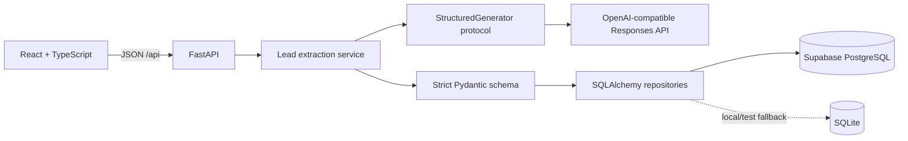

# Arriendate Intelligence

An internal real-estate operating layer that turns an unstructured lead into validated, traceable CRM data.

> Current milestone: structured lead extraction with AI plus execution observability.

This repository is intentionally incremental. This milestone does **not** contain property matching, embeddings, RAG, autonomous agents, n8n workflows, outbound messages, or quantum optimization.

## Product flow

```text
original lead message → durable lead record → explicit human extraction action
                      → strict provider JSON Schema → strict server validation
                      → requirements + lead status + observable AI run
```

The original request is stored before any AI call. A malformed, incomplete, refused, or unavailable provider response never creates or replaces structured requirements. The failed attempt remains visible as sanitized `ai_runs` metadata.

## Architecture



- FastAPI is the only browser-facing data and AI boundary.
- The provider adapter returns text and telemetry, never trusted domain objects.
- `lead_requirements` is updated only after strict server validation succeeds.
- Every attempt creates a durable `ai_runs` row before the external call.
- Prompts and raw model outputs are not stored in `ai_runs`; only a prompt version and sanitized metadata are persisted.
- SQL under `supabase/migrations` is authoritative for PostgreSQL. SQLite is a zero-install local/test adapter.

See [architecture decisions](docs/architecture.md), [AI guardrails](docs/ai-guardrails.md), [evaluation methodology](docs/evaluation.md), and the approved [implementation plan](docs/implementation-plan.md).

## Technology

| Layer | Tools |
|---|---|
| Web | React 19, strict TypeScript, Vite, React Router, TanStack Query, React Hook Form, Zod |
| API | Python 3.12+, FastAPI, Pydantic v2, SQLAlchemy 2, psycopg 3, HTTPX |
| AI | Versioned prompt, strict JSON Schema, OpenAI-compatible Responses API adapter |
| Data | Supabase PostgreSQL with RLS; SQLite local/test fallback |
| Testing | Pytest, Ruff, mypy, Vitest, Testing Library, Playwright |

## Repository map

```text
apps/web/                 CRM-like React UI
apps/api/app/ai/          schemas, prompts, provider contracts/adapters
apps/api/app/evaluation/  reusable extraction evaluator
apps/api/tests/           unit, provider-contract, evaluation and integration tests
supabase/migrations/      authoritative PostgreSQL schema
supabase/seed/            18 synthetic Chilean properties
evals/datasets/           versioned synthetic Spanish lead cases
evals/results/            ignored generated reports
docs/                     architecture, guardrails, evaluation and plan
```

## Local setup

Prerequisites:

- Node.js 22+
- Python 3.12+
- Optional for the production-like database: Docker and the project-scoped Supabase CLI

From the repository root in PowerShell:

```powershell
Copy-Item .env.example .env
npm.cmd install
python -m venv .venv
.\.venv\Scripts\python.exe -m pip install -e ".\apps\api[dev]"
```

Start the API and web app in separate terminals:

```powershell
.\.venv\Scripts\python.exe -m uvicorn app.main:app --app-dir apps/api --reload --host 127.0.0.1 --port 8000
npm.cmd run dev:web
```

Open `http://127.0.0.1:5173`. API documentation is at `http://127.0.0.1:8000/docs`.

Without an `.env`, local lead/property operations use `.local/arriendate.db`. AI extraction stays disabled and returns a visible, observable error until a server-side provider is configured.

### AI configuration

All AI settings are server-only and use the `ARRIENDATE_` prefix. Never put an AI key in a `VITE_*` variable.

```dotenv
ARRIENDATE_AI_PROVIDER=openai_compatible
ARRIENDATE_AI_BASE_URL=https://api.openai.com/v1
ARRIENDATE_AI_API_KEY=replace-locally
ARRIENDATE_AI_CHAT_MODEL=gpt-5.6-luna
ARRIENDATE_AI_REASONING_EFFORT=low
ARRIENDATE_AI_TIMEOUT_SECONDS=45
ARRIENDATE_AI_MAX_RETRIES=2
```

`gpt-5.6-luna` is the configurable default for this routine, latency/cost-sensitive extraction task; the current flagship remains available through `ARRIENDATE_AI_CHAT_MODEL`. The adapter uses strict Structured Outputs through `text.format`, disables response storage with `store: false`, and records usage only when the provider returns it. See the official [model-selection guidance](https://developers.openai.com/api/docs/guides/latest-model) and [Responses API reference](https://platform.openai.com/docs/api-reference/responses/create).

Optional `ARRIENDATE_AI_INPUT_COST_PER_MILLION` and `ARRIENDATE_AI_OUTPUT_COST_PER_MILLION` values enable cost estimates. They are configuration, not hard-coded price claims.

### Local Supabase

When Docker is available:

```powershell
npm.cmd exec supabase -- start
npm.cmd exec supabase -- db reset
```

Then set `ARRIENDATE_DATABASE_URL` to the local PostgreSQL URL printed by Supabase. Migrations create `lead_requirements` and `ai_runs`, enable RLS, and revoke direct `anon`/`authenticated` access.

## API in this milestone

| Method | Path | Behavior |
|---|---|---|
| `GET` | `/api/health` | database readiness without secrets |
| `POST` | `/api/leads` | persist untouched lead text; requires an `Idempotency-Key` UUID |
| `GET` | `/api/leads/{id}` | lead, latest requirements, and last 10 extraction runs |
| `POST` | `/api/leads/{id}/extract` | explicit structured extraction and run telemetry |
| `GET` | `/api/properties` | synthetic inventory with basic filters |
| `GET` | `/api/properties/{id}` | synthetic property facts |

## Evaluation and quality checks

The default evaluation is deterministic and requires no key. It evaluates 15 labeled Spanish lead cases and rejects 7 intentionally invalid outputs:

```powershell
.\.venv\Scripts\python.exe evals\scripts\evaluate_lead_extraction.py
```

An opt-in live run uses the same prompt and JSON Schema as production:

```powershell
.\.venv\Scripts\python.exe evals\scripts\evaluate_lead_extraction.py --mode live
```

Generated reports are written to the ignored `evals/results/lead_extraction.latest.json`. Live runs require provider environment variables and may incur cost.

Pull requests and pushes to `main` run the same backend/frontend checks through
`.github/workflows/ci.yml`. CI uses Python 3.12, Node.js 22, SQLite, mocks, and the offline
fixture evaluation; it does not receive an AI API key or start PostgreSQL/Supabase.

Run all checks:

```powershell
# Backend
.\.venv\Scripts\python.exe -m ruff check apps/api evals/scripts
.\.venv\Scripts\python.exe -m mypy apps/api/app
.\.venv\Scripts\python.exe -m pytest apps/api/tests -q

# Frontend
npm.cmd run typecheck:web
npm.cmd run lint:web
npm.cmd run test:web
npm.cmd run build:web

# Browser flow; requires Microsoft Edge and the deterministic test API/web processes
# API: .\.venv\Scripts\python.exe -m uvicorn tests.e2e_app:app --app-dir apps/api --host 127.0.0.1 --port 8000
# Web: npm.cmd run dev:web -- --host 127.0.0.1 --port 5173
npm.cmd run test:e2e
```

## Enforced guardrails

- All machine-consumed output is schema-constrained at the provider and strictly revalidated by the server.
- Unknowns remain `null`/empty with explicit missing-information markers; values are never guessed to repair output.
- Transport retries are bounded and limited to transient failures.
- Provider response bodies, original lead text, prompts, and credentials are absent from persisted AI telemetry and sanitized errors.
- Extraction is a human-triggered action; no external communication is sent.
- Browser rendering uses React text nodes, not injected HTML.
- Direct browser database roles have no table privileges in the supplied migrations.

## Known limitations

- No live provider evaluation is reproducible without a separately supplied API key; the committed suite uses deterministic fixtures and an HTTP mock of the Responses API contract.
- Supabase migrations, PostgreSQL arrays, triggers, grants, and RLS still require execution against a real PostgreSQL/Supabase instance. SQLite validates application behavior only.
- Cost remains `null` unless both provider usage and current per-million prices are configured.
- Authentication is not implemented. The app is intended for local/internal evaluation and is not ready for public deployment.
- Matching, RAG, agents, n8n, outbound messaging, and later milestones are intentionally absent.
